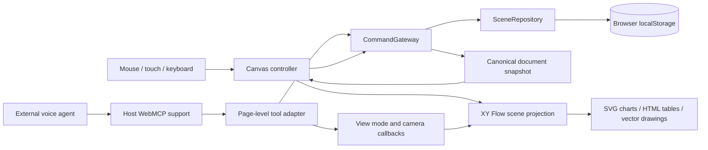

# webmcp-canvas

A visual workspace for conversations with an AI agent. Speak to an external agent, let it create or update objects on the open board, and continue editing the same objects with the mouse, touch, or keyboard.

webmcp-canvas combines a Next.js client, an XY Flow canvas, semantic charts and tables, animated vector drawings, and page-scoped WebMCP tools. Human interactions and agent commands share a document model, validation rules, version history, and undo mechanism.

**Current status:** a working, browser-local prototype. The repository implements the shared canvas and command flow; it does not yet implement the production backend, authentication, media pipeline, or a built-in voice connection described in the [technical design](docs/plan.md).

## Contents

- [What you can do](#what-you-can-do)
- [Quick start](#quick-start)
- [Using the board](#using-the-board)
- [Architecture](#architecture)
- [Document and command model](#document-and-command-model)
- [WebMCP tools](#webmcp-tools)
- [Persistence and recovery](#persistence-and-recovery)
- [Development and verification](#development-and-verification)
- [Relationship to the technical design](#relationship-to-the-technical-design)
- [Current limitations](#current-limitations)
- [Troubleshooting](#troubleshooting)

## What you can do

| Capability | Current implementation |
| --- | --- |
| Navigate the canvas | Drag the background, zoom with the wheel or pinch gesture, and navigate with the interactive minimap. |
| Manipulate objects | Select, move, resize from corners or edges, rotate, hide, and lock objects. Tables move by their title bar. |
| Create charts | Add semantic bar charts with bounded category/value arrays and named color palettes. Charts use Apache ECharts with an SVG renderer. |
| Create tables | Add tables through `add_table`, with a title, column labels, and plain string/number cells. Tables render as real HTML tables. |
| Create drawings | Add closed vector paths through `add_freehand`, or use the toolbar's circle preset. New strokes animate along their path. |
| Stretch drawings | Resize width and height independently, including turning a circle into an oval. Rotated objects resize along their local axes. |
| Edit existing text and annotations | Render and update the seeded text/annotation objects. Creating new ones is not yet exposed. |
| Work with an agent | Read scene context and execute narrow, validated commands through nine WebMCP tools. |
| Present a clean board | Hide the header, tool rail, object panel, and activity dock. The board, minimap, attribution, and return button remain visible. |
| Restore work | Save the document, operation results, and event history in browser local storage. |
| Undo changes | Append a compensating event for a previous creation or update. |

The canvas and object renderers use a dark palette. The surrounding editing interface retains its current mixed dark/light styling; there is no theme selector.

### Where voice lives

In the implemented workflow, the external agent host owns the microphone, transcription, speech output, and conversation. webmcp-canvas receives completed tool calls on the open page. It does not receive a continuous audio stream or partial transcript.

WebMCP connects the agent to the page's actions. It does not render the board or provide speech recognition. The application remains manually usable when the host does not expose `document.modelContext.registerTool`; agent-driven actions require a compatible host and an open top-level page.

## Quick start

### Requirements

- Node.js 22.x or 24.x and npm; these versions satisfy the installed Next.js and Vitest engine ranges.
- A modern browser for manual editing.
- An agent host exposing the WebMCP registration API for voice/agent control. The development workflow uses the Codex built-in browser.

No environment file, API key, database, Docker service, or separate application API is required for this prototype.

### Run locally

From the repository root:

```bash
npm ci
npm run dev
```

Open [the local app](http://localhost:3000), or the address printed by Next.js if another port is selected. For agent control, open that address in the host's built-in browser as a top-level page.

On first load, the app seeds a **Q1 Planning** document containing a sales chart, title, and annotation. Later loads use the document stored for that browser origin. The tables and drawings created during a local session are user data; they are not part of the initial fixture.

Use the same hostname and port when returning to your work: `localhost` and `127.0.0.1` have separate browser storage.

### Available scripts

| Command | Purpose |
| --- | --- |
| `npm run dev` | Start the Next.js development server with hot updates. |
| `npm run typecheck` | Check TypeScript without emitting application code. |
| `npm test` | Run the complete Vitest suite. |
| `npm run build` | Produce a Next.js production build. |
| `npm start` | Serve an existing production build. |

The build/start scripts are provided by the project; their presence is not evidence of a production deployment or a completed release gate.

## Using the board

### Mouse, touch, and keyboard

| Action | How to use it |
| --- | --- |
| Pan | Press and drag an empty area of the board with the left mouse button or a touch gesture. |
| Zoom | Use the mouse wheel, pinch gesture, or object-panel zoom buttons. The camera supports 25–300%; the panel buttons currently use narrower 75–150% bounds. |
| Navigate an overview | Drag or zoom within the minimap. |
| Select | Click an object or its entry in the Objects panel. |
| Move | Drag the object; for a table, drag its title bar above the cells. |
| Resize | Select an unlocked object and drag one of the four corner handles or four edge zones. |
| Rotate | Drag the rotation handle extending from the selection frame. |
| Nudge | With the object focused, use an arrow key for 8 canvas units, or Shift + arrow for 24. |
| Hide or lock | Use the visibility or lock button beside an object in the Objects panel. |
| Undo | Use the Undo button or ask the agent to invoke `undo`. |
| Hide the interface | Use the expand icon near the lower-right controls, or invoke `set_canvas_view`. |
| Restore the interface | Use the remaining return button or press Escape. |

Resize and rotation gestures show a live preview and commit the final change when released. Panning and zooming change the camera without changing document history. Table cells can scroll independently of the board.

The toolbar's **Add chart** button creates a sample bar chart. **Draw a circle** creates an animated, hand-drawn-style closed path; it is a preset, not a general pointer-based pencil tool. The table, text, shape, annotation, and media creation buttons remain marked as planned even though tables can already be created through WebMCP.

### Example voice requests

With the page open and site tools available, requests can include:

- “Create a bar chart for January, February, and March with values 10, 14, and 9.”
- “Make that chart green and rename it Revenue.”
- “Create a table with five reasons to stay home today.”
- “Draw a circle, then stretch it into an oval.”
- “Hide this object.”
- “Center the canvas on the table and fit it on screen.”
- “Hide the interface,” or “Show the interface.”
- “Undo the last change.”

These are examples of intent the external agent can translate into tools, not hard-coded phrases or a speech parser implemented by this site. A request for a new unsupported capability still requires development.

## Architecture

The current application runs its domain gateway and persistence adapter in the browser. Next.js serves the application; there are no application API routes or server-side document services yet.



### Technology stack

| Layer | Package / implementation |
| --- | --- |
| Application | Next.js 16.3.4, App Router |
| UI | React and React DOM 19.2.8, TypeScript 5.9.2 |
| Canvas navigation | `@xyflow/react`, locked to 12.11.6 |
| Charts | Apache ECharts 6.1.0, dynamically loaded on the client |
| Styling | Project CSS in `src/app/globals.css` |
| Domain | Typed commands, scene objects, events, and an in-browser gateway |
| Persistence | Local-storage repository; memory repository for tests and fallback |
| Agent adapter | Top-level `document.modelContext.registerTool` integration |
| Tests | Vitest 4.1.11, Node environment, static React rendering where applicable |

Dependency declarations are in [package.json](package.json); resolved versions are recorded in [package-lock.json](package-lock.json).

### Source layout

```text
src/
├── app/
│   ├── page.tsx                  # Application entry point
│   ├── layout.tsx                # Metadata, styles, early view-mode restoration
│   └── globals.css               # Editor and renderer styling
├── components/voice-canvas/
│   ├── VoiceCanvas.tsx           # Editor shell and interface visibility
│   ├── useCanvasController.ts    # Commands, selection, feedback, persistence setup
│   ├── SceneCanvas.tsx           # XY Flow nodes, gestures, camera, minimap
│   ├── EChart.tsx                # Semantic chart-to-ECharts compilation
│   ├── FreehandObjectView.tsx    # Closed SVG paths and drawing animation
│   ├── TableObjectView.tsx       # Accessible HTML table renderer
│   ├── ObjectNavigator.tsx       # Object selection, visibility, locking, search
│   ├── canvasViewport.ts         # Pan, zoom, and object-focus calculations
│   ├── canvasViewPreference.ts   # Session-scoped canvas-only preference
│   └── rotatedResize.ts          # Resize geometry in rotated local coordinates
├── domain/
│   ├── types.ts                  # Canonical objects, commands, results, events
│   ├── gateway.ts                # Validation, mutations, version checks, undo
│   ├── persistence.ts            # Local and memory repository implementations
│   └── fixtures.ts               # Empty and demonstration documents
└── webmcp/
    ├── schemas.ts                # Closed, bounded tool input schemas
    ├── register.ts               # Capability checks and tool-to-command mapping
    └── register.test.ts          # Registration and tool contract tests
```

Tests for domain behavior, view preferences, renderers, and geometry live next to the corresponding source files. [docs/plan.md](docs/plan.md) contains the broader technical design in Russian; `design/` contains visual references.

## Document and command model

The [domain types](src/domain/types.ts) are independent of XY Flow. The renderer projects domain objects into nodes rather than treating the renderer's store as the saved document.

A document contains its identity, schema version, document version, ordered root IDs, object map, event history, stored operation results, and undone-operation IDs. Objects have stable IDs, a frame `{ x, y, width, height }`, optional rotation in degrees, visibility and lock flags, type-specific properties, timestamps, and actor/provenance metadata.

All current objects are roots (`parentId: null`). Group hierarchies and general scale transforms from the technical design are not implemented. Frame coordinates are canvas-space units; at 100% zoom, a unit corresponds to a CSS pixel. Rotation is stored on the object, outside `frame`.

The command union currently contains `AddChart`, `AddFreehand`, `AddTable`, `UpdateObject`, and `Undo`.

### Applying a document change

1. The UI or WebMCP adapter constructs a command with an operation ID and expected document version. The adapter supplies correlation and actor metadata.
2. The gateway checks for a previously applied operation ID, then checks the expected version and validates the command.
3. The handler prepares the next object state, event, result, and document version.
4. The repository saves the next complete document before the gateway publishes it as its current state.
5. The controller applies the snapshot to the visible scene and updates action feedback.

Each applied command increments `documentVersion` by one. Duplicate, conflicting, and rejected calls do not add another event.

### Idempotency, conflicts, and undo

- **Idempotency:** repeating an applied operation ID returns its stored result with `status: "duplicate"`. Use a new ID for each new intent. Reusing an ID with different arguments does not update the original operation; the implementation does not compare payload hashes.
- **Concurrency:** a stale `expectedDocumentVersion` returns `conflict` and the current version. Read the scene again before deciding on a new write. Do not blindly retry a changed intent.
- **Undo:** appends a `CommandUndone` event. Undoing an addition removes it from the active object map; undoing an update restores its previous object state. The historical events remain stored.
- **Current undo scope:** the latest eligible addition/update is chosen across the local document, including both human and agent changes. Targeted undo is supported, but there is no actor-ownership or dependent-edit protection yet. Redo is not implemented.

## WebMCP tools

The [registration adapter](src/webmcp/register.ts) registers nine tools after the local document is restored and only when running in a supported top-level page. It checks capability availability and tracks registered names to reduce duplicate registration during React development updates.

The [input schemas](src/webmcp/schemas.ts) close object inputs to unknown properties and bound strings, arrays, numbers, and enums. Runtime adapter checks and domain validators further constrain document changes. Tools accept semantic data, not arbitrary JavaScript, HTML, raw SVG, SQL, or ECharts option objects.

| Tool | Purpose | Changes document history? |
| --- | --- | --- |
| `get_scene_summary` | Read version, visible-object counts, up to 24 object summaries, and selected IDs. | No |
| `get_object` | Read one exact object by ID and the current document version. | No |
| `add_chart` | Create a bar chart from categories, values, palette, and optional placement. | Yes |
| `add_freehand` | Create a closed vector drawing from local points, stroke settings, and a frame. | Yes |
| `add_table` | Create a table from a title, columns, rows, and a frame. | Yes |
| `update_object` | Change allowlisted properties of one exact object. | Yes |
| `undo` | Compensate the latest eligible change or an explicit target operation. | Yes |
| `set_canvas_view` | Switch between `canvas_only` and `standard`. | No |
| `set_canvas_viewport` | Set zoom/pan or center and optionally fit an object. | No |

Document writes require `operationId` and `expectedDocumentVersion`. They do not accept caller-supplied actor, workspace, or document IDs. View-only tools do not require a document-write envelope.

### Example: create and update a chart

The following blocks are tool argument objects, not HTTP requests or a standalone browser SDK. First call `get_scene_summary`:

```json
{
  "detail": "compact",
  "includeRecentChanges": false
}
```

Use the returned version in `add_chart`. Here, `12` is illustrative:

```json
{
  "operationId": "demo-create-revenue-001",
  "expectedDocumentVersion": 12,
  "chartSpec": {
    "kind": "bar",
    "title": "Revenue",
    "categories": ["January", "February", "March"],
    "values": [10, 14, 9],
    "colorToken": "duo"
  },
  "placement": { "x": 160, "y": 120, "width": 570, "height": 365 },
  "selectAfterCreate": true
}
```

An applied result returns `operationId`, `documentVersion`, `objectIds`, `eventIds`, a summary, and retryability. Use the returned object ID and current version in `update_object`; replace `obj_returned_chart` below with the actual ID:

```json
{
  "operationId": "demo-update-revenue-002",
  "expectedDocumentVersion": 13,
  "objectId": "obj_returned_chart",
  "changes": {
    "title": "Quarterly revenue",
    "colorToken": "green"
  }
}
```

### Example: add a table

Pass this argument shape to `add_table`, substituting the current document version:

```json
{
  "operationId": "demo-create-table-003",
  "expectedDocumentVersion": 14,
  "title": "Weekend options",
  "columns": ["Activity", "Duration"],
  "rows": [["Read a book", "30 min"], ["Make dinner", "45 min"]],
  "placement": { "x": 180, "y": 150, "width": 620, "height": 240 },
  "selectAfterCreate": true
}
```

To focus it, call `set_canvas_viewport` with the actual table ID:

```json
{
  "focusObjectId": "obj_returned_table",
  "fit": true
}
```

Use `set_canvas_view` with `{ "mode": "canvas_only" }` to hide the interface or `{ "mode": "standard" }` to restore it. Camera `zoom` is expressed as a percentage, such as `100`, not a scale factor of `1`.

### Supported data and update limits

| Object / operation | Key constraints |
| --- | --- |
| Chart creation | Bar charts only; 1–12 categories; category labels up to 24 characters; one matching value per category, between 0 and 100,000. |
| Chart palettes | `duo`, `coral`, `ink`, or `green`; the dark renderer maps tokens to readable colors. |
| Table creation | 2–6 columns, 1–12 rows; every row matches the column count; labels up to 32 characters, text cells up to 80 characters, finite numeric cells bounded to ±1 billion. |
| Freehand creation | 8–256 points inside the original placement frame; optional pressure from 0 to 1; stroke width 1–24; `coral` or `ink`; paths are closed. |
| Object update | Only `title`, chart `colorToken`, `hidden`, `locked`, `rotation`, and partial `frame`. Updating `title` maps to the type's title, label, or text. |
| Rotation | Input from −360 to 360 degrees, normalized to a nonnegative angle. |
| Geometry | Finite, bounded coordinates and positive, type-dependent dimensions. Creation, tool updates, and drag controls have some different size limits; consult the schemas and gateway for exact values. |

Chart data arrays, table columns/cells, and freehand points cannot currently be edited through `update_object`. There is no general JSON-patch tool.

The current read flags are accepted for contract compatibility, but `detail`, `includeRecentChanges`, and `includeDataPreview` do not yet alter the output. Scene summaries omit hidden objects; an exact `get_object` call can still return a hidden object. Hiding content is not an access-control boundary.

## Persistence and recovery

| State | Location | Survives reload? |
| --- | --- | --- |
| Document, objects, events, operation results | `localStorage`: `voice-canvas:document:prototype-v1` | Yes, while storage remains available for that origin. |
| Canvas-only preference | `sessionStorage`: `voice-canvas:view-mode` | Yes, for the browser tab's session. |
| Camera, selection, pending feedback, animation state | React state | Not durably persisted. |

Storage keys retain their original `voice-canvas` prefix for compatibility with existing saved boards and view preferences.

The repository saves the entire document snapshot for each accepted change. Startup performs basic format checks and falls back to the demo document when saved data is absent, unreadable, or incompatible. This is not server-backed event replay or a backup system.

If the initial storage save fails, the controller switches to an in-memory repository and displays a warning that changes will not survive reload. Later persistence errors are reported as rejected commands. Storage availability and quota therefore matter for long sessions.

Canvas-only mode is restored early in page startup to avoid briefly exposing the editing panels. Creating or updating objects does not explicitly change that mode. A new freehand object animates for roughly 0.8 seconds, with its selection controls deferred until completion; restored objects do not replay the animation. Reduced-motion preferences disable new-stroke animation.

## Development and verification

Start with checks relevant to the changed layer. For example:

```bash
# Domain commands and WebMCP contracts
npm test -- src/domain/gateway.test.ts src/webmcp/register.test.ts

# Freehand scaling and rotated resize geometry
npm test -- src/components/voice-canvas/FreehandObjectView.test.ts src/components/voice-canvas/rotatedResize.test.ts

# TypeScript
npm run typecheck
```

The existing tests cover chart creation/update/undo, stable IDs, duplicate operations, stale-version conflicts, frame updates, freehand and table creation, closed tool schemas, unsupported-host fallback, registration behavior, table semantics, view preferences, and camera/resize calculations.

Vitest runs in a Node environment. These checks do not establish real browser pointer behavior, accessibility certification, voice-host tool discovery, or production readiness. No automated browser E2E suite is currently checked in.

### Manual integration check

1. Open the app and verify whether the header reports **WebMCP ready** or **WebMCP unavailable**.
2. Add a chart through the UI, then create or update an object through the actual host's site tools.
3. Verify the returned object ID and version against the visible result.
4. Pan, zoom, move a table by its title, and resize a drawing into an oval.
5. Rotate that oval and resize it along each local axis; confirm that the final dimensions persist after release.
6. Undo the most recent test change, then reload and check the stored document.
7. Enter canvas-only mode, reload, and confirm that panels stay hidden until explicitly restored.

Use a disposable scene or preserve your work before testing undo and storage recovery. Respect the repository's resource-approval rules in [AGENTS.md](AGENTS.md) and the active task instructions before dependency installation, full-suite testing, or production builds.

## Relationship to the technical design

[docs/plan.md](docs/plan.md) defines the intended service architecture, trust boundaries, integration modes, implementation phases, and release acceptance criteria. It is broader than the current application. This README describes the checked-in implementation and makes the differences explicit.

| Area | Technical design | Current repository |
| --- | --- | --- |
| Frontend host | React/Vite recommendation | Next.js App Router, following the implementation decision. |
| Canvas engine | tldraw recommendation | XY Flow / React Flow with custom object renderers and rotated resize controls. |
| Command boundary | Authenticated server service | Shared in-browser `CommandGateway`. |
| Persistence | PostgreSQL, transactional events, snapshots, idempotency, outbox | Whole-document local-storage snapshots and local event history. |
| Synchronization | WebSocket fan-out and HTTP catch-up | One page's in-memory projection; no cross-tab or multi-user synchronization. |
| Objects | Text, shapes, freehand, charts, media, annotations, groups | Charts, tables, closed freehand paths, and seeded text/annotations. |
| Undo/redo | Actor-scoped, dependency-aware undo and redo | Local compensating undo across actors; no redo. |
| Voice mode A | External voice host controlling the open page | Implemented page-tool adapter, dependent on host capability. |
| Voice mode B | Site-owned Realtime/WebRTC voice agent | Planned; no microphone UI, token endpoint, or Realtime client. |
| Mode C | Optional standalone remote MCP adapter | Planned; no remote MCP server. |
| Media and export | Verified assets, storage workers, JSON/SVG/PNG export | Planned; no upload/import pipeline or export implementation. |

The code preserves the central design choice: semantic commands and domain objects remain separate from the renderer. Server-side persistence and other adapters can build on these concepts, but the production guarantees in the plan still require implementation and verification.

The remaining roadmap includes authenticated document/workspace access, transactional persistence and synchronization, richer editing and object types, verified image/video assets, safe delete and redo, versioned export, operational hardening, and optional site-owned voice or remote MCP integrations. The phase definitions and acceptance gates remain in the technical design.

## Current limitations

- **Local prototype security:** actors are fixed local human/agent labels, not authenticated principals. There are no server-side ACLs, session authentication, rate limits, or tamper-resistant audit storage.
- **Single-document storage:** no document picker, account sync, collaboration protocol, or cross-tab version coordination. Concurrent tabs can overwrite the same origin's saved document.
- **Editing coverage:** no general text/cell editor, open-stroke pencil capture, shape/group creation, image/video import, dedicated delete command, redo, or export. Hiding is an implemented reversible alternative to removing an object from view.
- **Partial toolbar wiring:** the “Fit selected object” toolbar button currently selects the first chart rather than fitting the camera. Use `set_canvas_viewport` with `focusObjectId` and `fit: true` for the implemented focus path.
- **Camera placement:** creation placement is explicit canvas geometry; toolbar presets do not fully account for an already panned/zoomed camera. Focus uses the unrotated frame, so a rotated object's visual bounds may not fit perfectly.
- **Scale and performance:** full snapshots and history are cloned/saved on writes; there is no event compaction or large-document benchmark. Timing targets in the design are goals, not measured service-level guarantees.
- **External speech latency:** the page applies commands after tool invocation. It cannot control the external host's speech recognition, reasoning, approval, or tool-dispatch latency.

React Flow attribution remains visible. `package.json` marks the project private, and the repository does not currently include a project license file.

## Troubleshooting

| Symptom | What to check |
| --- | --- |
| “WebMCP unavailable” | Verify that the host exposes `document.modelContext.registerTool`, the page is top-level, and tool support is enabled in that environment. Manual controls remain available. |
| A voice request produces no object | Check whether the host invoked a supported tool and whether its result was `applied`, `conflict`, or `rejected`. Spoken acknowledgement alone is not a successful write. |
| Version conflict | Read the current scene/object and construct a new intent using its latest version. |
| Object cannot be moved or resized | Unlock it in the Objects panel, select it, and use its actual frame handles. Drag tables by their title bar. |
| A created object is off-screen | Ask the agent to focus the exact returned object ID with `set_canvas_viewport`, or navigate with the minimap. |
| Work seems missing after reopening | Check the hostname, port, browser profile, and local-storage availability. These determine which saved document is loaded. |
| Old tool behavior after a development patch | Once pending gestures or writes finish, reload the page to refresh page-scoped handlers. View mode survives within the tab session; the camera is not persisted. |
| Need a fresh demo document | Back up the document storage value first, then remove only `voice-canvas:document:prototype-v1` from this origin's local storage and reload. This discards the local scene and its undo history. |

For implementation details, start with the [controller](src/components/voice-canvas/useCanvasController.ts), [gateway](src/domain/gateway.ts), and [WebMCP schemas](src/webmcp/schemas.ts). For the intended production system, read the [technical design](docs/plan.md).
