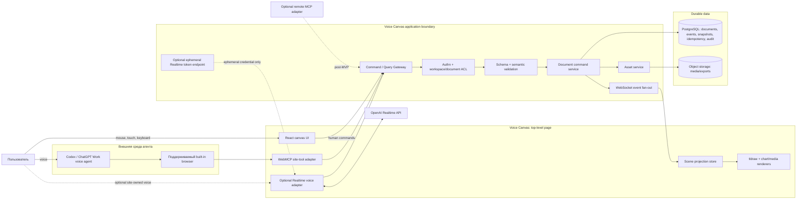
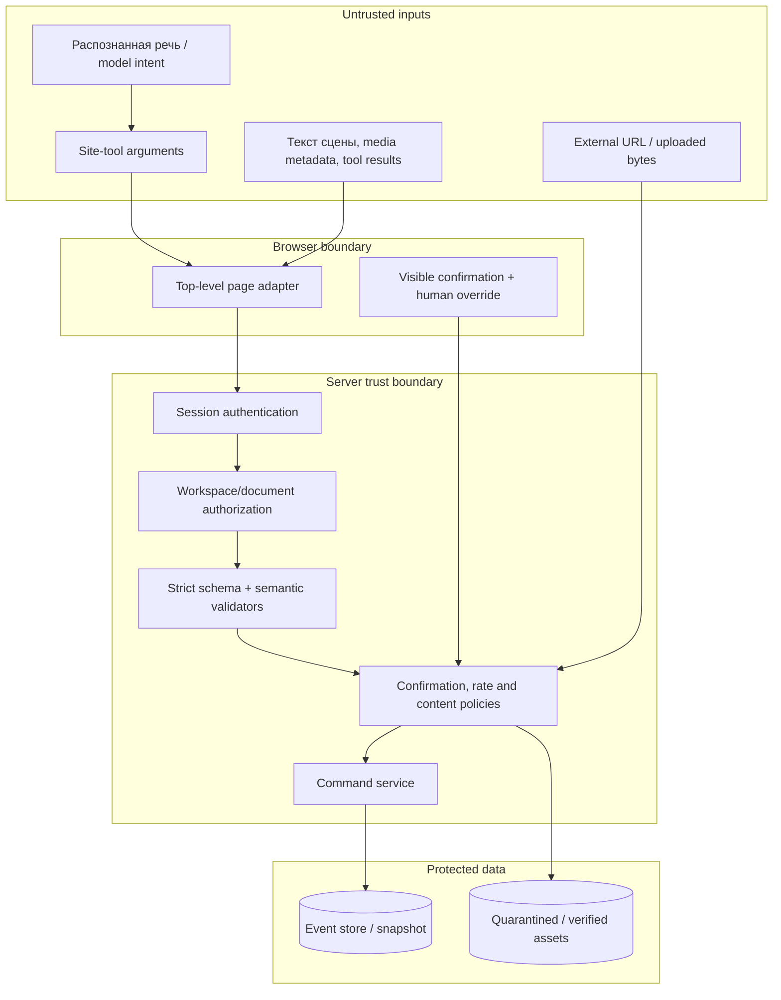

# Voice Canvas + WebMCP — технический дизайн

**Статус:** Builder draft, готов к техническому review  
**Дата актуализации источников:** 2026-09-04  
**Тип документа:** implementation-ready design; код и инфраструктура не создаются  
**Основной сценарий:** внешний голосовой агент в поддерживаемом встроенном браузере управляет той же открытой страницей через WebMCP site tools.

## 1. Результат и границы

Voice Canvas — отдельный полноэкранный web-клиент с визуальной сценой. Пользователь открывает документ, входит в аккаунт и продолжает голосовой диалог с AI-агентом. Агент читает краткое состояние сцены и вызывает типизированные site tools: создаёт график, меняет его, добавляет текст, фигуры, рисунки, изображения, видео и аннотации. Принятая команда сразу отражается на открытой странице; результат содержит стабильные object IDs для следующего голосового уточнения.

Ключевая граница решения:

> **WebMCP — мост типизированных команд текущей страницы и её signed-in session. Это не renderer, не канал передачи голоса и не механизм автоматического появления Markdown-визуализаций в чате.**

Renderer, document model, сохранение, авторизация и undo принадлежат Voice Canvas. Голос в основном сценарии принадлежит внешнему продукту-агенту. Собственный голосовой агент сайта — отдельный, необязательный канал, использующий тот же application command layer.

### 1.1 Цели MVP

- одна открытая сцена редактируется человеком и агентом через одинаковые доменные команды;
- WebMCP предоставляет небольшой семантический набор read/write tools без универсального выполнения кода;
- каждый write идемпотентен, авторизован, версионирован и записан в event log;
- UI показывает действие агента, pending/error/conflict и даёт немедленный human override/undo;
- reload восстанавливает подтверждённую сцену;
- архитектура допускает собственный Realtime voice agent без второй реализации бизнес-логики.

### 1.2 Явные non-goals MVP

- обучение или строительство foundation voice model;
- remote MCP server, фоновые автоматизации и работа без открытой страницы;
- полноценное multiplayer/CRDT-редактирование и offline write;
- генерация изображений/видео внутри сервиса;
- произвольный JavaScript, HTML, CSS, ECharts option или SQL от модели;
- гарантированное управление из любого браузера, любого голосового чата или после закрытия/навигации страницы;
- публичные share links, marketplace, плагины, native mobile clients;
- production deployment, миграции и уже измеренные SLO: все численные latency-показатели ниже — проектные targets.

## 2. Три разных интеграционных режима

| Режим | Кто ведёт голос | Как вызывается действие | Где выполняется adapter | Нужна открытая страница | Авторизация | Роль в плане |
|---|---|---|---|---|---|---|
| **A. Внешний Codex/ChatGPT agent + WebMCP** | Поддерживаемый внешний агент в desktop built-in browser | Agent обнаруживает page-scoped site tool и вызывает его | JavaScript верхнеуровневой страницы | Да; именно текущая страница | Текущая web-session + повторная server-side authz/ACL | Основной MVP |
| **B. Встроенный voice agent сайта** | Voice Canvas через OpenAI Realtime API | Realtime `function` tool вызывает тот же command gateway | Frontend/server adapter Voice Canvas | Для live canvas — да | Site session; backend выдаёт только ephemeral Realtime credential | После MVP-A |
| **C. Обычный local/remote MCP server** | Любой совместимый MCP host; голос необязателен | Host подключается к MCP server независимо от page | Отдельный server adapter | Нет | OAuth/service token + тот же ACL | Опционально для фоновых задач |

Официальное руководство определяет site tools как реализацию **proposed WebMCP standard**, позволяющую агенту и пользователю работать с одной live page и signed-in session. Оно отдельно отличает WebMCP от local/remote MCP, который может работать без открытой страницы. На 2026-09-04 документированная поддержка относится к built-in browser в ChatGPT desktop app для ChatGPT Work и Codex и зависит от rollout, модели, workspace и инструментов страницы. Поэтому режим A — capability-gated enhancement, а обычный UI остаётся рабочим без него. [OpenAI: Site tools (WebMCP)](https://learn.chatgpt.com/docs/webmcp)

### 2.1 Текущие WebMCP-ограничения, влияющие на дизайн

- tool принадлежит странице; закрытие страницы или навигация может сделать его недоступным;
- регистрация выполняется JavaScript-кодом **top-level page** через `document.modelContext.registerTool`;
- built-in browser сейчас не обнаруживает tools, зарегистрированные в iframe, включая same-origin iframe;
- declarative API через HTML form attributes сейчас не поддерживается;
- website tool definitions, page content и tool results считаются untrusted;
- browser safety review дополняет, но не заменяет authz, validation и confirmation самого приложения.

Следствие: canvas shell, WebMCP registration и текущий document context находятся в верхнеуровневом document. Визуальные media-элементы могут использовать внутренние DOM-компоненты, но не должны быть единственным местом регистрации tools.

## 3. Архитектура

### 3.1 Компоненты и потоки



Правило зависимости: **adapter переводит внешний tool call в `CanvasCommand`/`CanvasQuery`; только command service решает, допустимо ли действие и как меняется документ.** Ни WebMCP handler, ни Realtime handler, ни renderer не реализуют отдельные ACL, undo или mutation rules.

### 3.2 Trust boundaries



Никакой текст страницы или tool result не становится system/developer instruction. `actor`, роли, document binding и permission scope выводятся сервером из сессии, а не принимаются из model-supplied JSON.

## 4. Scene graph и document model

### 4.1 Координаты и порядок

- **Page space:** бесконечная логическая плоскость; единица равна одному CSS pixel при zoom `1`.
- **Object local space:** `x`, `y`, `width`, `height`, `rotation`, `scaleX`, `scaleY` относительно `parentId`; группы формируют иерархические transforms.
- **Screen/viewport state:** camera, zoom, cursor, selection и active tool — session/presence state, не часть canonical document snapshot, кроме явно сохранённого presentation view.
- **z-order:** стабильный строковый fractional index либо эквивалентный sortable key внутри одного parent; изменение слоя — отдельная команда. Массив объектов не является источником порядка.
- Все размеры конечны, ограничены policy maximum; `NaN`, infinity, чрезмерные координаты и отрицательные размеры отвергаются.

### 4.2 Document

```ts
type CanvasDocument = {
  id: string
  workspaceId: string
  title: string
  schemaVersion: number
  documentVersion: number
  rootObjectIds: string[]
  createdAt: string
  updatedAt: string
  createdBy: ActorRef
  lastEventSequence: number
}
```

`documentVersion` — монотонное целое, увеличиваемое на один для каждой принятой command group. `schemaVersion` управляет миграцией формата, а не optimistic concurrency.

### 4.3 Общая форма объекта

```ts
type SceneObjectBase = {
  id: string                       // immutable opaque ID, например obj_...
  type: "text" | "shape" | "freehand" | "chart" |
        "image" | "video" | "annotation" | "group"
  parentId: string | null
  zIndex: string
  frame: {
    x: number; y: number; width: number; height: number
    rotation: number; scaleX: number; scaleY: number
  }
  opacity: number
  hidden: boolean
  locked: boolean
  properties: Record<string, unknown> // discriminated schema by type
  dataRef: DataRef | null
  provenance: Provenance
  createdBy: ActorRef
  updatedBy: ActorRef
  createdAt: string
  updatedAt: string
  lastOperationId: string
}
```

`ActorRef` хранит `actorType: human | external_agent | site_voice_agent | remote_mcp`, internal subject ID и display label. Роли и permissions не копируются в объект как источник истины.

`Provenance` хранит источник (`human`, `tool`, `import`, `generated`), provider/model только если это разрешено политикой, source asset/dataset IDs, tool name, operation ID и необязательную user-visible attribution. Секреты, raw prompts и подписанные URL туда не попадают.

### 4.4 Типы объектов

| Тип | Обязательные properties | Ограничения |
|---|---|---|
| `text` | `plainText` или безопасные text runs, font token, size, align, color | MVP не хранит исполняемый HTML; ссылки проходят URL policy |
| `shape` | `shapeKind` (`rectangle`, `ellipse`, `line`, `arrow`, `polygon`), fill/stroke tokens | Ограниченный enum; без raw SVG script/filter |
| `freehand` | bounded point array `{x,y,pressure?}`, stroke width/color, smoothing preset | Лимиты точек/размера; упрощение path до сохранения |
| `chart` | versioned `ChartSpec`: chart kind, encodings, axes, legend, theme token | Только семантическая схема; raw ECharts option/function запрещены |
| `image` | `assetId`, fit/crop, alt text | Renderer получает short-lived URL после ACL; URL не хранится в сцене |
| `video` | `assetId`, optional poster/captions asset IDs, controls, muted, startAt | Autoplay со звуком запрещён; export использует poster/current approved frame |
| `annotation` | target object IDs или canvas anchor, text, status, visual style | Потерянная target-ссылка становится orphaned, но не удаляет annotation |
| `group` | child IDs выводятся по `parentId`; optional label/layout hint | Delete группы требует явной cascade policy и может потребовать confirmation |

### 4.5 DataRef и assets

```ts
type DataRef =
  | { kind: "inline"; schema: "tabular-v1"; data: unknown; contentHash: string }
  | { kind: "dataset"; datasetId: string; datasetVersion: number }
  | { kind: "asset"; assetId: string; mediaType: string }
```

Inline chart data имеет жёсткий byte/row limit. Большие таблицы, изображения и видео передаются не через WebMCP payload, а через проверенный `datasetId`/`assetId`. Сервер выдаёт renderer-у короткоживущий signed URL только после session + document ACL. URL не возвращается agent tool result, если он не нужен пользователю.

Asset lifecycle: `initiated → uploading → quarantined → scanning → ready | rejected | failed → deleting → deleted`. `add_media` принимает только `ready` asset того же workspace. Multipart upload возобновляемый; checksum и declared MIME сверяются с фактическим типом.

## 5. Command bus, event log и сохранение

### 5.1 Command envelope

```ts
type CanvasCommand<T> = {
  operationId: string              // обязательный idempotency key намерения
  correlationId: string
  documentId: string               // adapter берёт из active page context
  expectedDocumentVersion: number
  commandType: string
  payload: T
  requestedAt: string
  actor: ActorRef                  // сервер выводит из authenticated principal
}
```

Для WebMCP `documentId`, `workspaceId` и `actor` отсутствуют во входной JSON Schema: handler связывает вызов с текущим документом и session. Это предотвращает confused-deputy переход к чужому документу.

### 5.2 Транзакционный pipeline

1. Adapter создаёт `correlationId`, нормализует tool input и передаёт intent в gateway.
2. Сервер аутентифицирует session, проверяет workspace/document ACL и capability.
3. JSON Schema и type-specific semantic validator проверяют payload, лимиты, asset/dataset references и confirmation token.
4. Idempotency store ищет `(documentId, operationId)`. Уже завершённая операция возвращает сохранённый result без повторного side effect.
5. В одной PostgreSQL transaction блокируется document head и сравнивается `expectedDocumentVersion`.
6. Domain handler вычисляет изменения, обратимую inverse-command metadata и events.
7. Events, новый head/version, idempotency result, audit record и outbox message записываются атомарно.
8. После commit projector/fan-out обновляет все вкладки; текущая страница подтверждает optimistic projection либо заменяет её canonical state.

Стандартный result:

```ts
type CommandResult = {
  status: "applied" | "duplicate" | "pending" | "conflict" | "rejected"
  operationId: string
  documentVersion: number
  objectIds: string[]
  eventIds: string[]
  summary: string
  retryable: boolean
  errorCode?: string
  currentDocumentVersion?: number
}
```

### 5.3 Event model

Каждый event имеет `eventId`, `documentId`, последовательный `sequence`, `documentVersion`, `operationId`, `commandId`, `correlationId`, `eventType`, versioned payload, `author/actor`, `occurredAt` и provenance summary. Основные события: `ObjectAdded`, `ObjectUpdated`, `ObjectDeleted`, `ObjectsReparented`, `ZOrderChanged`, `AssetAttached`, `CommandUndone`, `CommandRedone`, `DocumentRenamed`.

Event log append-only. Snapshot — ускоритель чтения, не альтернативный источник истины. Проектная настройка MVP: snapshot после configurable number of events и при idle; точный порог выбирается нагрузочным тестом, а не фиксируется как production fact.

### 5.4 Optimistic concurrency

- каждый write требует `expectedDocumentVersion`;
- mismatch возвращает `conflict`, текущую версию и компактную информацию о затронутых object IDs;
- adapter не делает blind retry изменяющей команды: сначала `get_scene_summary`/`get_object`, затем агент пересобирает intent с новой версией;
- автоматический retry разрешён только для transport uncertainty с тем же `operationId` и неизменным payload;
- локальный drag/text edit может быть optimistic; при reject UI откатывает projection и сохраняет пользовательский черновик.

### 5.5 Undo/redo и safe delete

- undo не перематывает общий log: создаётся новая compensating command group и новые events;
- по умолчанию actor отменяет последний собственный обратимый command group;
- `targetOperationId` допускается только если зависимости не делают inversion опасной;
- redo повторяет отменённый intent на текущей версии после повторной validation;
- delete создаёт tombstone event; object исчезает из active projection, но остаётся восстановимым через undo;
- физический asset GC выполняется после retention/grace period и проверки ссылок;
- bulk delete, delete locked/group с большим числом descendants, permanent delete и изменение share/permission требуют отдельного confirmation; permanent delete не входит в WebMCP MVP.

### 5.6 Восстановление

При загрузке клиент получает latest compatible snapshot, затем events до head. WebSocket подключается с `lastEventSequence`; пропущенные события дочитываются по HTTP. Если local cache повреждён или schema несовместима, он отбрасывается и строится canonical projection с сервера. IndexedDB можно использовать только как last-known read cache; offline mutation в MVP запрещена.

## 6. Page-level WebMCP registration

Registration выполняется один раз в top-level app shell после определения browser capability и готовности session/document context. Handler вызывает существующий gateway; он не меняет store напрямую.

```ts
const mc = document.modelContext

if (typeof mc?.registerTool === "function") {
  await mc.registerTool({
    name: "add_chart",
    description: "Add a validated chart to the currently open canvas document.",
    inputSchema: addChartInputSchema,
    execute: async (input) => {
      const context = activeDocumentContext.requireCurrent()

      return commandGateway.execute({
        commandType: "AddChart",
        operationId: input.operationId,
        expectedDocumentVersion: input.expectedDocumentVersion,
        payload: mapAddChartInput(input),
        context, // current page + authenticated session; not model supplied
      })
    },
  })
}
```

Для read tools добавляется `annotations: { readOnlyHint: true }`, как в официальном примере. Side-effect/confirmation metadata также ведётся во внутреннем registry и отражается в description, однако security policy не доверяет названию или аннотации tool.

Implementation rules:

- `additionalProperties: false`, bounded strings/arrays/enums и schema version для каждого input;
- в SPA handler читает **текущий** document context во время execute, а не замыкает устаревший ID;
- если session истекла, документ сменился, страница закрывается или projection не готов, возвращается структурированный `TOOL_UNAVAILABLE`/`AUTH_REQUIRED`, side effect не выполняется;
- registration не помещается в iframe и не использует declarative form attributes;
- UI полностью доступен без `document.modelContext`;
- запрещён tool вроде `execute_javascript`, `run_code`, `set_arbitrary_state` или общий JSON Patch без type-specific allowlist.

Официальное руководство рекомендует узкие inputs, явное описание side effects, проверяемый result и повторное использование существующих authentication, authorization и validation. [OpenAI: Add WebMCP to your website](https://learn.chatgpt.com/docs/webmcp#add-webmcp-to-your-website)

## 7. Каталог WebMCP site tools

### 7.1 Общие правила контракта

- Tool всегда действует на текущий document top-level page; произвольный `documentId` не принимается.
- Write inputs обязательно содержат `operationId` и `expectedDocumentVersion`.
- Placement задаётся как `{x,y,width?,height?,anchor?: "viewport-center" | "selection-right"}`; сервер нормализует и ограничивает координаты.
- Write output возвращает `status`, `documentVersion`, `operationId`, `objectIds`, `eventIds`, короткий `summary`; не возвращает секреты, auth tokens, raw asset URL или весь документ.
- Reads минимизируют данные: summary прежде full content. Для точного изменения агент запрашивает только нужный object.
- Confirmation принимает server-issued short-lived token, привязанный к exact intent hash, actor, document version и expiry. Текстовое «да» внутри scene content не является подтверждением.

### 7.2 Read tools

| Tool | Назначение | Основные input | Основной output | Side effects / permission |
|---|---|---|---|---|
| `get_scene_summary` | Контекст текущей сцены перед действием | `detail: compact | standard`, `includeRecentChanges: boolean` | version, object counts, bounded object summaries `{id,type,label,bounds}`, viewport, current selection, capabilities | Нет; `document:read`; без confirmation |
| `get_selection` | Узнать, на что указывает пользователь | `includeProperties: boolean` | version, selected IDs/types/bounds и безопасные type-specific properties | Нет; `document:read`; не возвращает скрытые/недоступные объекты |
| `get_object` | Прочитать один объект для точного follow-up | `objectId`, `includeDataPreview: boolean` | current version, validated object summary/spec, small data preview или dataset metadata | Нет; `document:read`; full media bytes/URL не выдаются |
| `get_operation_status` | Проверить долгий export/asset operation | `operationId` | `queued | running | completed | failed | cancelled`, progress bucket, result IDs/error code | Нет; только операции текущего actor/document |

### 7.3 Write tools

| Tool | Назначение | Основные input | Output | Side effects, confirmation, permission |
|---|---|---|---|---|
| `add_chart` | Добавить семантический график | common write fields; `chartSpec {kind,title,encodings,axes?,legend?,themeToken}`, `dataRef`, placement, `selectAfterCreate` | новый chart object ID, version, normalized spec summary | Создаёт object/events; `document:edit`; обычно без confirmation; reject raw renderer options |
| `add_text_or_shape` | Добавить текст или базовую фигуру | common; discriminated `kind`; text/shape properties; placement | object ID, version | Создаёт object/events; `document:edit`; без confirmation в пределах лимитов |
| `add_freehand` | Добавить bounded vector stroke/annotation stroke | common; points, stroke token, width, placement | freehand object ID, version, simplified point count | Создаёт object/events; `document:edit`; schema/size limits; без confirmation |
| `add_media` | Поместить ранее проверенный image/video asset | common; `assetId`, `mediaKind`, alt text, optional captions/poster asset ID, placement | media object ID, version, asset readiness | Создаёт object/reference; `document:edit` + `asset:read`; только ready same-workspace asset; без arbitrary URL |
| `update_object` | Изменить конкретный ранее созданный object | common; `objectId`; type-specific allowlisted `changes`; optional `selectAfterUpdate` | object ID, changed fields, version | Мутирует object; `document:edit`; locked/protected fields reject; confirmation только для policy-significant change |
| `delete_object` | Безопасно удалить один object/group | common; `objectId`; `cascade`; optional `confirmationToken` | tombstoned IDs, undo availability, version | Reversible delete; `document:edit`; confirmation для group/cascade/large or consequential delete |
| `undo` | Компенсировать последнюю подходящую команду actor | common; optional `targetOperationId` | reverted operation/object IDs, version, `redoAvailable` | Новые compensating events; `document:edit`; cross-actor undo запрещён/эскалируется |
| `redo` | Повторить последнюю отменённую команду actor | common; optional `targetOperationId` | reapplied IDs, version | Новые events; `document:edit`; повторная validation и conflict check |
| `export_scene` | Создать snapshot/export artifact | common; `format: scene-json | png | svg`, scope, scale, background, optional `confirmationToken` | `pending` operation ID либо ready `exportAssetId`, version used | Не меняет сцену, но создаёт asset; `document:read + export:create`; public/external share не входит и требует отдельной confirmation |

`add_media` намеренно не загружает большие bytes. Upload/import выполняется через обычный UI и Asset API; post-MVP remote MCP может подготовить asset в фоне, после чего page tool получает только `assetId`.

## 8. Рендеринг и projection adapter

### 8.1 Рекомендуемый render host

MVP использует tldraw SDK как interaction/render host: готовые text/geo/draw/group/media primitives, selection, transforms, camera и custom shape API. Официальная документация описывает shape records с ID, position, z-index, parent и type-specific props, а также custom `ShapeUtil` на React. [tldraw: Shapes](https://tldraw.dev/sdk-features/shapes)

Canonical scene model остаётся независимым от tldraw:

- `SceneProjector` детерминированно отображает domain objects в tldraw records; domain ID хранится как стабильный shape ID/meta;
- human interactions сначала могут отображаться optimistic, но на commit преобразуются в domain commands;
- raw tldraw store mutation не считается сохранённой бизнес-операцией;
- remote/agent events применяются как remote projection changes, чтобы не породить второй command loop;
- renderer-specific props не попадают в WebMCP schema без domain allowlist.

### 8.2 По типам

- **Text/shape/group:** built-in shapes, но fonts/colors/line styles ограничены design tokens. Text сохраняется как plain text/safe runs; edit mode остаётся доступным клавиатурой.
- **Freehand:** vector points после smoothing/simplification. Во время stroke обновляется local ephemeral preview; один завершённый stroke — одна command group. Очень длинный stroke режется/отклоняется по лимиту.
- **Chart:** custom shape на React с Apache ECharts. Domain `ChartSpec` компилируется в allowlisted ECharts option; никакие функции/formatter code из model input не исполняются. SVG renderer — default для чёткого zoom/export и умеренных datasets; Canvas renderer выбирается policy для больших series после performance test. Официальный ECharts handbook описывает оба renderer и рекомендует выбирать по объёму данных/среде. [Apache ECharts: Canvas vs SVG](https://echarts.apache.org/handbook/en/best-practices/canvas-vs-svg/)
- **Image:** custom/built-in media shape получает signed URL через AssetResolver, декодирует image off main interaction path, показывает skeleton/error; alt text обязателен или явно помечен как pending.
- **Video:** DOM `<video>` внутри custom shape с native controls, keyboard focus, captions track и poster. Голосовая команда не запускает autoplay со звуком. Camera transforms синхронизируют video DOM с page space.
- **Annotation:** pin/callout/highlight custom shapes; `targetObjectIds` разрешаются projection-слоем. При удалении target annotation становится orphaned и предлагает relink/delete.

### 8.3 Export

- `scene-json` — versioned canonical snapshot без signed URLs и session state;
- `svg` — только объекты с безопасным vector representation; chart экспортируется из разрешённой spec, image встраивается только при export policy; video заменяется poster;
- `png` — raster композиция фиксированной document version; cross-origin media не рисуется напрямую, только same-origin/verified asset proxy;
- export обязан указать `documentVersionUsed`; изменение сцены во время export не меняет его результат.

tldraw поддерживает snapshots и custom persistence, но в этом решении они используются как render/cache механизм; authoritative восстановление идёт из domain snapshot + events. [tldraw: Persistence](https://tldraw.dev/sdk-features/persistence)

## 9. Sequence: «построй график, затем измени его голосом»

```mermaid
sequenceDiagram
    actor U as Пользователь
    participant V as Внешний voice agent
    participant H as Built-in browser/WebMCP host
    participant P as Top-level page adapter
    participant C as Command service
    participant D as PostgreSQL/event log
    participant R as Scene projector/renderer

    U->>V: «Построй столбчатый график продаж по месяцам»
    V->>H: get_scene_summary()
    H->>P: execute read tool
    P-->>V: documentVersion=12, empty scene
    V->>H: add_chart(operationId=op1, expectedVersion=12, semantic spec)
    H->>H: browser safety review / confirmation if required
    H->>P: execute write tool
    P->>C: AddChart bound to current document/session
    C->>C: authz + schema + idempotency + version check
    C->>D: transaction: ObjectAdded + version=13
    D-->>C: committed chartId=chart_42
    C-->>P: applied, chart_42, version=13
    C-->>R: ObjectAdded event
    R-->>U: график виден; agent badge/highlight
    P-->>V: chart_42, version=13, summary

    U->>V: «Сделай именно этот график зелёным и добавь подпись»
    V->>H: update_object(objectId=chart_42, operationId=op2, expectedVersion=13)
    H->>P: execute write tool
    P->>C: UpdateObject(chart_42)
    C->>D: transaction: ObjectUpdated + version=14
    C-->>R: ObjectUpdated event
    R-->>U: тот же chart_42 обновлён
    P-->>V: applied, chart_42, version=14
```

Если между двумя командами человек изменил документ и версия уже `14`, второй write получает `conflict`, ничего не меняет, затем агент читает текущий object/version и предлагает/повторяет осмысленную команду с новым `operationId`.

## 10. Realtime и voice orchestration

### 10.1 Режим A: внешний voice agent

- External host владеет microphone, speech recognition, voice response, turn-taking и своим conversation state.
- Страница не предполагает доступ к partial transcript внешнего host: она показывает `agent preparing/executing` только с момента site-tool invocation, если host не предоставляет отдельный поддерживаемый signal.
- Agent получает object IDs из tool results и использует их в follow-up. При сомнении он вызывает `get_selection`, `get_object` или `get_scene_summary`.
- Page close/navigation, capability rollout или unsupported model/workspace могут убрать tools. UI остаётся ручным; агент не должен заявлять успех без applied result и видимого/прочитанного подтверждения.
- Нет обещания, что текущий произвольный voice chat автоматически обнаружит и вызовет эти tools: нужен поддерживаемый built-in browser, открытая top-level page и доступность site tools.

### 10.2 Режим B: собственный voice agent сайта

OpenAI документирует browser flow, где backend создаёт ephemeral client secret, frontend подключается к Realtime session через WebRTC, а tools/interruptions обрабатываются в session. Standard API key остаётся только на сервере. [OpenAI: Voice agents](https://developers.openai.com/api/docs/guides/voice-agents) [OpenAI: Realtime WebRTC](https://developers.openai.com/api/docs/guides/realtime-webrtc)

В Voice Canvas:

1. Authenticated backend выдаёт короткоживущий Realtime client secret для текущего пользователя; standard API key никогда не попадает в browser.
2. Realtime session объявляет `function` tools, эквивалентные WebMCP catalog. Function adapter вызывает тот же `CommandGateway`.
3. Partial transcript используется только для captions/preview состояния; mutation разрешена после завершённых function-call arguments и validation final intent.
4. App возвращает `function_call_output` с `CommandResult`; модель продолжает ответ только после результата. Официальная документация различает app-executed `function` tools и Realtime-executed remote `mcp` tools. [OpenAI: Realtime with tools](https://developers.openai.com/api/docs/guides/realtime-mcp)
5. VAD настраивается как product setting. `interrupt_response` позволяет barge-in в speech-to-speech session; это отменяет/обрезает ответ агента, но не откатывает уже committed canvas command. [OpenAI: Voice activity detection](https://developers.openai.com/api/docs/guides/realtime-vad)

Модель Realtime выбирается runtime configuration (`OPENAI_REALTIME_MODEL`) из актуально поддерживаемых, а не фиксируется навсегда в document schema.

### 10.3 Состояния и cancellation

UI state machine:

`idle → listening → partial → intent_finalized → tool_planned → awaiting_confirmation? → executing → applied → rendered → speaking/idle`

Ветки: `cancelled`, `conflict`, `rejected`, `failed`, `tool_unavailable`.

- до server acceptance cancel прерывает pending request через `AbortController` и помечает operation cancelled;
- после commit cancel не скрывает результат и не делает implicit rollback; UI говорит «действие уже применено» и предлагает undo;
- long operations проверяют cancellation token между безопасными стадиями;
- повторный network request использует тот же `operationId`;
- новый semantic intent всегда получает новый `operationId`.

### 10.4 Проектные latency targets, не измеренные факты

| Участок | Target |
|---|---:|
| Локальная индикация microphone/listening в режиме B | ≤100 ms p95 |
| Partial caption после доступного transcription event в режиме B | ≤300 ms p50 |
| Command gateway: accepted write до committed result без media upload | ≤250 ms p50, ≤700 ms p95 |
| Committed event до paint на уже подключённой странице | ≤150 ms p50, ≤400 ms p95 |
| Final user intent до видимого простого chart в режиме B | ≤1.5 s p50, ≤3 s p95 |
| Режим A end-to-end | измеряется отдельно; внешний host/rollout не контролируется сервисом |

Targets исключают upload/transcoding/generative media. Перед production они заменяются измеренными baselines и SLO.

## 11. Security и privacy

### 11.1 Обязательные controls

- **Untrusted tool surface:** definitions/results/page content — data, не инструкции; tool name и `readOnlyHint` не считаются доказательством безопасности. Это соответствует официальной WebMCP security boundary. [OpenAI: WebMCP security and user controls](https://learn.chatgpt.com/docs/webmcp#security-and-user-controls)
- **Authn/authz:** HttpOnly Secure SameSite cookie или эквивалентная server session; CSRF protection для cookie-auth writes; каждый запрос проверяет workspace membership, document role и object/asset scope.
- **Strict contracts:** JSON Schema с `additionalProperties: false`, всеми полями required или explicit nullable, enum/range/length/array limits; затем независимая domain validation. OpenAI рекомендует `strict: true` для function calling и описывает эти schema requirements. [OpenAI: Function calling — Strict mode](https://developers.openai.com/api/docs/guides/function-calling#strict-mode)
- **Prompt injection:** текст объекта, alt text, imported metadata, captions и remote tool output никогда не конкатенируются в privileged prompt как инструкции. Они помечаются как quoted user data; agent не получает page secrets.
- **URL/media:** WebMCP принимает `assetId`, не arbitrary URL. Separate import service защищён от SSRF: DNS/IP validation, redirect re-check, private/link-local denylist, MIME sniffing, size/time limits, malware scan, image decode sandbox, video transcoding profile.
- **Content provenance:** сохраняются source type, content hash, asset/dataset IDs, actor, operation/tool IDs и timestamps; generated/imported content визуально помечается по policy.
- **Rate limits:** per session/user/workspace/document/tool; отдельные лимиты на writes, points, data rows, upload bytes и exports. При превышении — typed `RATE_LIMITED` с safe retry hint.
- **Audit:** append-only security audit для tool name, actor, document, affected IDs, decision, confirmation и correlation IDs; без raw audio, full scene text, tokens и signed URLs.
- **Confirmation:** browser safety review не заменяет app policy. Consequential/destructive/bulk/public действия получают preview + exact-intent confirmation token. Обычный reversible single-object add/update не требует лишнего диалога.
- **Data minimization:** read tools возвращают summaries; hidden/inaccessible objects исключаются; secret fields не входят ни в schemas, ни в results.
- **Retention/deletion:** raw audio не хранится по умолчанию; режим B отдельно получает consent на transcript retention. Audit/event/snapshot/asset retention задаётся workspace policy. Account/document deletion ставит tombstones, отзывает URLs, удаляет derived exports и завершает physical purge после legal/grace constraints.

### 11.2 Permission matrix MVP

| Role | Read | Add/update | Delete/undo own | Export | Manage ACL/permanent delete |
|---|---:|---:|---:|---:|---:|
| Viewer | Да | Нет | Нет | По workspace policy | Нет |
| Commenter | Да | Только annotation | Свои annotations | Нет/по policy | Нет |
| Editor | Да | Да | Да, в policy limits | Да | Нет |
| Owner/Admin | Да | Да | Да | Да | Только обычный UI с усиленной confirmation; не WebMCP MVP |

## 12. UX и accessibility

- Agent action отображается до, во время и после выполнения: badge/cursor halo, target outline, verb, actor и timestamp; цвет не единственный носитель статуса.
- Pending object — skeleton с `aria-live="polite"`; error/conflict содержит понятную причину и кнопки retry/reload/undo, а не только toast.
- Selection общая по смыслу, но не полностью общая по persistence: human selection — session state; agent возвращает/подсвечивает affected IDs. Follow-up «этот» разрешается через текущую selection + IDs, но destructive intent требует точной проверки.
- Любое agent action можно остановить до commit; после commit доступен Undo. Ручное редактирование никогда не блокируется голосом дольше confirmation modal.
- Canvas имеет DOM object navigator/list с доступными именами, type, order и selection; keyboard shortcuts для pan/select/move/resize/layer/undo; focus не теряется после remote update.
- Text, annotation и chart summary доступны screen reader; chart имеет generated accessible table/description, редактируемые пользователем.
- Image требует alt text; video имеет controls, captions/transcript asset при наличии и не autoplay со звуком.
- `prefers-reduced-motion` отключает fly-to/animated morph; agent changes используют короткий статический highlight.
- В режиме B captions включаемы, microphone state всегда видим, есть mute/end session и просмотр/удаление сохранённого transcript согласно policy.

## 13. Observability

### 13.1 Correlation chain

`voiceTurnId → toolCallId → operationId → commandId → eventId[] → projectionAckId → renderFrameId`

- Режим A может не передать `voiceTurnId`; тогда adapter создаёт root `correlationId` и сохраняет доступный host call reference.
- Режим B генерирует `voiceTurnId` на начале input turn и связывает Realtime events/function call.
- Все IDs возвращаются/логируются в минимальном объёме, достаточном для support trace; пользователю показывается короткий reference.

### 13.2 Метрики

- tool discovery/availability rate по browser/app version без user content;
- call count, applied/duplicate/conflict/rejected/error по tool и actor type;
- schema/authz/confirmation/rate-limit rejection;
- command commit, event fan-out, projection и render latency;
- Realtime connection/VAD/function-call latency в режиме B;
- asset upload/scan/transcode/export stage latency и failures;
- reconnect gap size, snapshot load time, dropped/duplicate event count;
- undo rate после agent action как safety/quality signal, не как обвиняющая user metric.

Privacy-safe logging: IDs псевдонимизируются, text/data values не логируются по умолчанию, audio/API keys/cookies/signed URLs запрещены, debug sampling требует workspace policy и срок удаления.

## 14. Reliability и обработка отказов

| Сбой | Ожидаемое поведение |
|---|---|
| Timeout после write, commit неизвестен | Повторить **тот же** payload с тем же `operationId`; получить `duplicate` или первый result |
| Stale `documentVersion` | Никакого side effect; вернуть conflict/current version, перечитать target и заново сформировать intent |
| Дублированный tool call | Idempotency store возвращает исходный result; один набор events/object IDs |
| Partial asset upload | Resume multipart по upload ID; `add_media` до `ready` возвращает `ASSET_NOT_READY`; orphan parts GC |
| Scan/transcode failed | Asset `rejected/failed`, object не создаётся; безопасная причина без scanner internals |
| Page navigation/close | WebMCP tool становится unavailable; pending HTTP может завершиться серверно, поэтому после открытия нужно проверить `operationId` |
| Unsupported browser/WebMCP disabled | Site tools не регистрируются; feature hint и обычный accessible UI продолжают работать |
| Session expired/ACL changed | `AUTH_REQUIRED`/`FORBIDDEN`, no mutation; после входа intent не replay без нового user confirmation |
| WebSocket disconnect | UI показывает offline/read-only; reconnect с `lastEventSequence`, HTTP catch-up, затем live events |
| Projection/render exception | Error boundary изолирует object, canonical state сохраняется; fallback object card + telemetry |
| Snapshot incompatible/corrupt | Load предыдущего compatible snapshot + replay; при невозможности — read-only recovery view |
| Realtime session interrupted | Canvas commit остаётся; новый session восстанавливает scene context через queries, не из скрытой model memory |
| Export worker failed | Operation `failed`, retry с новым operation intent; scene не меняется, partial artifact удаляется |

Outbox pattern предотвращает ситуацию «DB committed, fan-out потерян»: projector дочитывает события после reconnect. Read-your-writes достигается HTTP result + локальной canonical application; WebSocket подтверждает остальные вкладки.

## 15. Testing strategy

### 15.1 Уровни

| Уровень | Что проверяется | Минимальный gate |
|---|---|---|
| Schema contract | Все WebMCP и Realtime function schemas, strict/unknown fields, bounds, nullable, versioning | Golden valid/invalid fixtures; одинаковая domain command mapping для A и B |
| Command unit | Authz, state transitions, inverse commands, locked/group/media rules | Deterministic events/result на каждую команду |
| Persistence integration | Atomic head/events/idempotency/outbox/snapshot replay | Fault injection до/после commit; один side effect |
| WebMCP integration | Top-level registration, discovery, read/write result, iframe negative case, navigation unavailability | Проверка в актуально поддерживаемом built-in browser и feature-disabled fallback |
| Browser E2E | Empty canvas, human + agent edits, visible states, reload | Playwright для обычного UI; отдельный host-assisted suite для настоящих site tools |
| Concurrency/idempotency | Два writer-а на одной версии, retries, reconnect | Один accepted, один conflict; retry returns duplicate |
| Security | ACL/CSRF, injection strings, oversized payload, URL/asset scope, confirmation replay | Ни один payload не обходит command policy; secrets отсутствуют в result/log |
| Accessibility | Keyboard-only, screen reader names/order, focus, captions, reduced motion, contrast | Automated axe + manual keyboard/screen-reader checklist |
| Performance | Object count, chart points, event replay, export, memory | Targets из §10.4 на согласованном reference device; regression budgets |
| Recovery | Lost socket, corrupt cache, failed asset/export, reload mid-command | Canonical scene не теряется и не удваивается |

### 15.2 Полный acceptance scenario первого vertical slice

**Given** пользователь signed in как Editor, открыл пустой документ в top-level page поддерживаемого built-in browser, site tools доступны, `documentVersion=1`.

1. Пользователь голосом просит: «Построй столбчатый график продаж: январь 10, февраль 14, март 9».
2. Агент вызывает `get_scene_summary`, затем `add_chart` с bounded inline data, `operationId=op-create`, `expectedDocumentVersion=1`.
3. Сервер создаёт ровно один chart object, event и version `2`; UI показывает pending → applied → rendered.
4. Tool result возвращает тот же `chartId` и version `2`; график виден без reload.
5. Пользователь говорит: «Сделай именно этот график зелёным и назови “Продажи Q1”».
6. Агент вызывает `update_object` для возвращённого `chartId` с новым `operationId` и version `2`.
7. Тот же object обновляется, новый не создаётся; version становится `3`.
8. Пользователь нажимает/говорит Undo; compensating event возвращает прежний style/title, version становится `4`, redo доступен.
9. Browser reload загружает document head version `4`; сцена совпадает с состоянием после undo.
10. Повтор `op-create` возвращает original/duplicate result и не создаёт второй chart.

Acceptance evidence: event rows и IDs, WebMCP call results, browser recording/screenshots, reload comparison, idempotency assertion, отсутствие console/server errors. Проверка голосового host отдельно отмечает, какой app/model/workspace/browser version фактически использован; симулированный tool call не выдаётся за live voice proof.

## 16. Рекомендуемый MVP stack

### 16.1 Выбор

| Слой | Рекомендация | Причина |
|---|---|---|
| Frontend | TypeScript + React SPA (Vite), top-level app shell | Canvas-heavy client без обязательного SSR; простая feature detection/registration |
| Canvas host | tldraw SDK + custom chart/video/annotation shapes | Готовые selection, transforms, draw, text, groups, camera, history primitives; custom React shapes |
| Charts | Apache ECharts, semantic compiler, SVG default / Canvas policy fallback | Широкий набор chart types и два renderer; raw option не открыт агенту |
| API | Node.js + Fastify, JSON Schema first | Один TypeScript contract; быстрые narrow command/query endpoints и WebSocket |
| Durable data | PostgreSQL | Transactional document head, event log, idempotency, snapshots, audit/outbox |
| Media | S3-compatible object storage + isolated scan/transcode worker | Большие bytes вне WebMCP/DB; signed scoped delivery |
| Realtime sync | WebSocket + HTTP catch-up/outbox | Достаточно для single-writer optimistic concurrency MVP; без CRDT complexity |
| Site-owned voice B | OpenAI Realtime API через WebRTC; backend ephemeral credential; optional Agents SDK | Low-latency browser voice и function tools; не требуется свой voice model |
| Telemetry | OpenTelemetry-compatible traces/metrics/logs | Сквозная correlation без привязки к одному vendor |

Перед установкой нужно закрепить exact package versions в lockfile и выполнить security/license review. В частности, официальные условия tldraw на момент проверки требуют trial/commercial/hobby license для production; default terms разрешают SDK только в development. Это обязательный Phase 0 decision gate, а не скрытая зависимость. [tldraw: License](https://tldraw.dev/community/license)

### 16.2 Альтернативы

| Альтернатива | Плюсы | Минусы относительно рекомендации | Когда выбрать |
|---|---|---|---|
| React + Konva + custom editor | Более низкая зависимость от готового editor SDK, полный контроль; shapes/images/freehand доступны | Самостоятельно строить selection, transforms, text edit, accessibility navigator, DOM video/chart overlay, export и migrations | Если tldraw license неприемлема и команда принимает больший срок. [Konva: React shapes](https://konvajs.org/docs/react/Shapes.html) [Konva: Free drawing](https://konvajs.org/docs/react/Free_Drawing.html) |
| Custom SVG/DOM scene | Хороший DOM/a11y и vector export для умеренной сцены | Сложнее поддержать тысячи объектов, freehand, hit testing, camera/culling; больше собственного editor code | Если продукт ограничивает объектный набор и ставит document accessibility выше infinite-canvas scale |

CRDT/Yjs не включён в MVP: external agent и человек всё равно проходят через один server command head. Если появится одновременное rich multiplayer, его проектируют после измерения conflict patterns, не смешивая CRDT updates с уже определённой authz/event/audit моделью.

## 17. Implementation backlog

MVP-A = фазы P0–P4. P5 и P6 не блокируют основной сценарий.

| Фаза | Зависимости | Deliverables | Acceptance criteria | Non-goals |
|---|---|---|---|---|
| **P0 — contracts/capability spike** | Нет | Зафиксированные JSON Schemas; browser support matrix; top-level registration spike; tldraw license decision; threat model; ADR по IDs/versioning | Tool обнаруживается на минимальной page в фактически поддерживаемом host; iframe negative case; unsupported fallback; schemas проходят fixtures | Не строить canvas/editor/backend целиком; не обещать universal availability |
| **P1 — domain core + persistence** | P0 schemas/ADR | Scene model; command/query interfaces; ACL hooks; Postgres event/idempotency/snapshot/outbox design; projector contract | Add/update/delete/undo/replay deterministic; stale version conflict; duplicate operation one effect; reload from snapshot+events | Media, voice B, multiplayer, export UI |
| **P2 — первый vertical slice: chart create/update/undo/reload** | P1; minimal chart renderer | Empty canvas UI; `get_scene_summary`, `add_chart`, `get_object`, `update_object`, `undo`; chart custom shape; visible agent states | Полный scenario §15.2 проходит live в supported built-in browser; второй voice intent меняет exact returned ID; undo/reload/idempotency доказаны | Другие object types, asset upload, remote MCP, site-owned voice |
| **P3 — scene objects + assets** | P1/P2; Asset service | Text/shape/freehand/image/video/annotation/group; selection tools; asset upload/scan/resolver; safe delete/redo | Type contracts, keyboard edits, verified asset-only media, cascade confirmation, partial upload recovery | Generative media, arbitrary URL import tool, permanent delete |
| **P4 — MVP hardening/export/ops** | P2/P3 | Export, reconnect/catch-up, rate limits, audit, privacy controls, a11y object navigator, telemetry dashboards/runbooks | Security/a11y/performance/recovery gates §15; privacy-safe logs; png/svg/json version consistency | Public sharing, CRDT/offline write, production auto-scaling claims |
| **P5 — optional site-owned voice B** | Stable command catalog P4 | Ephemeral-token endpoint; Realtime/WebRTC session; function adapters; captions, VAD, interrupt/cancel UI | Same domain tests for WebMCP/function adapters; no standard API key in browser; barge-in semantics; transcript consent | Voice model training, telephony, background agent |
| **P6 — optional remote MCP C** | Stable public service API, OAuth policy | Narrow MCP server adapter, allowed tools, approvals, background asset/export operations | Работает без page; same ACL/idempotency/audit; no renderer assumptions | Замена WebMCP основного live-page flow, unrestricted service access |

Порядок реализации внутри каждой фазы: schema/contract → command handler → focused tests → adapter → visible UI state → acceptance evidence. Полные suites запускаются только после targeted gates и отдельного resource approval.

## 18. Decisions

| ID | Решение | Обоснование |
|---|---|---|
| D-001 | Режим A — основной MVP | Соответствует задаче совместной работы с той же открытой страницей |
| D-002 | WebMCP — thin adapter, command service — единственная mutation boundary | Не дублирует ACL/business/undo logic между A/B/C |
| D-003 | Canonical domain scene независима от renderer | Позволяет заменить tldraw и добавить remote MCP без изменения contracts |
| D-004 | Semantic high-level tools; нет arbitrary JS/JSON Patch | Снижает injection/validation blast radius и улучшает tool selection |
| D-005 | Every write: operation ID + expected version | Идемпотентность и явные concurrency conflicts |
| D-006 | Event log + snapshots; undo через compensating events | Auditability, reload/recovery и безопасная совместная история |
| D-007 | Media tools используют asset IDs | Не передавать большие/опасные payloads и signed URLs через agent context |
| D-008 | WebSocket sync без CRDT в MVP | Минимальная сложность при одной canonical command boundary |
| D-009 | Realtime B вызывает те же function-level commands | Голосовой transport не меняет domain semantics |
| D-010 | tldraw — рекомендуемый host с обязательным license gate | Быстрый путь к качественному editor UX, но стоимость/условия должны быть приняты до production |

## 19. Risks и mitigations

| Риск | Влияние | Mitigation / exit criterion |
|---|---|---|
| WebMCP proposed/subset/rollout меняется | Основной agent path может временно не работать | Capability detection, support matrix, Phase 0 live proof, обычный UI fallback, revalidation перед release |
| Внешний voice host не передаёт partial/progress | Нельзя показать ранний listening state в A | Не имитировать transcript; показывать state с момента tool invocation |
| tldraw license/roadmap неприемлемы | Блок production или бюджет | Решение в P0; заранее оценён Konva exit path; domain model не зависит от SDK |
| Renderer store и domain state расходятся | Потеря/дублирование edits | One-way canonical events, optimistic rollback, projection hashes/recovery tests |
| Agent использует устаревший object ID/version | Неверная цель/конфликт | IDs в results, `get_object`, mandatory expectedVersion, no blind retry |
| Prompt injection в scene/media metadata | Нежелательные tools/data exfiltration | Untrusted-data boundary, minimal reads, strict tools, authz, confirmation, injection tests |
| Огромные datasets/freehand/media | UI freeze/DoS | Bounded schemas, async asset pipeline, culling/decimation, per-tool limits |
| Undo после зависимых чужих edits | Повреждение общей сцены | Own-operation default, dependency check, refuse/preview conflict |
| Browser close во время uncertain write | Пользователь не знает result | Idempotent operation status/retry, audit, reload reconciliation |
| SVG/DOM media export различается с live view | Недостоверный export | Versioned export renderer tests; video poster policy; explicit unsupported warning |
| Privacy leakage в logs/transcripts | Compliance/user trust | No raw audio/default transcript storage, redaction, retention policy, deletion tests |

## 20. Open Questions

1. Какой identity provider и точная workspace/document role model используются новым сервисом?
2. Приемлема ли commercial tldraw license; если нет, принимается ли дополнительная стоимость Konva/custom editor?
3. Нужны ли multi-user cursors в MVP или достаточно человека и agent indicator в одной session?
4. Какой максимум объектов, chart rows/points, freehand points и media sizes задаёт reference workload?
5. Какие типы графиков входят в P2 и P3: bar/line/scatter/area/pie; нужны ли таблицы и live data refresh?
6. Должен ли agent получать доступ к полному тексту/данным скрытых objects или только к текущей видимой/разрешённой области?
7. Какой retention для event log, exports, assets, audit и optional transcripts требуется по workspace tier/региону?
8. Какие export formats обязательны в первом релизе и как экспортировать текущий frame видео?
9. Нужна ли confirmation для каждого agent write или только для consequential policy classes?
10. Как пользователь явно выбирает target голосом при нескольких похожих объектах: selection, spoken label, agent cursor или numbered overlay?
11. Какие supported ChatGPT/Codex workspace/model/browser combinations официально принимаются в release matrix на дату запуска?
12. Нужен ли режим B в том же MVP milestone или только архитектурная совместимость и отдельный следующий этап?

## 21. Источники и статус утверждений

Проверены открытые первичные страницы, а не поисковые сниппеты. Текущее состояние WebMCP и Realtime нужно повторно сверить в P0 и перед каждым release, потому что availability, модели и proposed APIs могут меняться.

- [OpenAI / ChatGPT Learn — Site tools (WebMCP)](https://learn.chatgpt.com/docs/webmcp): proposed status; same live page/signed-in session; WebMCP vs MCP; page lifecycle; security; top-level JavaScript registration; iframe/declarative ограничения. Проверено 2026-09-04.
- [OpenAI API — Voice agents](https://developers.openai.com/api/docs/guides/voice-agents): speech-to-speech vs chained voice; browser Realtime flow; tools/interruption. Проверено 2026-09-04.
- [OpenAI API — Realtime with tools](https://developers.openai.com/api/docs/guides/realtime-mcp): application-executed function tools, `function_call_output`, remote MCP differences, approvals/lifecycle. Проверено 2026-09-04.
- [OpenAI API — Realtime API with WebRTC](https://developers.openai.com/api/docs/guides/realtime-webrtc): browser WebRTC, backend-minted ephemeral client secret, запрет standard API key в browser. Проверено 2026-09-04.
- [OpenAI API — Voice activity detection](https://developers.openai.com/api/docs/guides/realtime-vad): server/semantic VAD и `interrupt_response`. Проверено 2026-09-04.
- [OpenAI API — Function calling](https://developers.openai.com/api/docs/guides/function-calling#strict-mode): JSON Schema function tools и strict mode requirements. Проверено 2026-09-04.
- [tldraw — Shapes](https://tldraw.dev/sdk-features/shapes) и [Persistence](https://tldraw.dev/sdk-features/persistence): shape/custom renderer/store/snapshot capabilities. Проверено 2026-09-04.
- [tldraw — License](https://tldraw.dev/community/license): production license requirement и default development-only terms. Проверено 2026-09-04.
- [Apache ECharts — Canvas vs SVG](https://echarts.apache.org/handbook/en/best-practices/canvas-vs-svg/): renderer trade-offs. Проверено 2026-09-04.
- [Konva — React shapes](https://konvajs.org/docs/react/Shapes.html) и [Free drawing](https://konvajs.org/docs/react/Free_Drawing.html): основание для альтернативного render/editor path. Проверено 2026-09-04.

Не являются подтверждёнными production facts: latency targets, throughput/object limits, browser/model availability на будущую дату, стоимость tldraw, выбранные package versions и производительность конкретного renderer. Они требуют P0/release verification.

## 22. Boss Loop Review Log

- Builder draft: 2026-09-04
- Revision budget document: 10
- Revisions used: 0
- Independent Boss Reviewer verdict: **ACCEPT**
- Blocking findings: none
- Accepted: 2026-09-04
